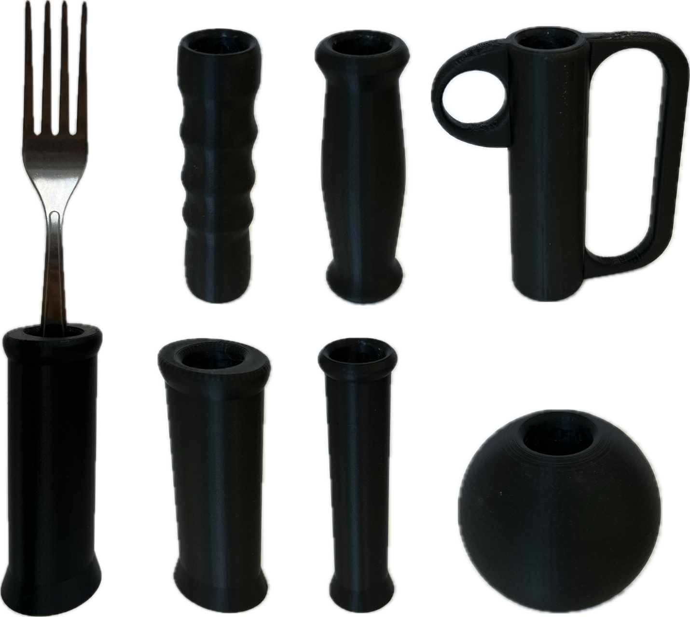

<!--- Open Source Assistive Technology: GitHub Readme Template Version 1.2 (2024-May-27)  --->

<!--- TITLE --->
# Adaptive Utensil Handles for IKEA IDENTITET

## Overview
<!--- A brief summary of the project. What it does, who it is for, how much it costs. --->
The Adaptive Utensil Handles for IKEA IDENTITET is an assistive technology device that provides a cost-effective way for individuals who struggle to grasp and manipulate utensils to eat independently.

The handles are comprised solely of 3D printed parts. 

The Adaptive Utensil Handles for IKEA IDENTITET is an open assistive technology (OpenAT). Under the terms of the open source licenses, the device may be built, used, and improved upon by anyone.

The overall cost of materials for a set of utensils and full set of handles is about $20 CAD.  

## Makers Making Change Assistive Device Library
https://www.makersmakingchange.com/s/product/adaptive-utensil-handles-for-ikea-identitet/01tJR000008gxv7YAA 

## How to Obtain the Device
### 1. Do-it-Yourself (DIY) or Do-it-Together (DIT)

This is an open-source assistive technology, so anyone is free to build it. All of the files and instructions required to build the device are contained within this repository. Refer to the Maker Guide below.

### 2. Request a build of this device

You may also submit a build request through the [Makers Making Change Assistive Device Library Listing](https://www.makersmakingchange.com/s/product/adaptive-utensil-handles-for-ikea-identitet/01tJR000008gxv7YAA) to have a volunteer maker build the device. As the requestor, you are responsible for reimbursing the maker for the cost of materials and any shipping.

### 3. Build this device for someone else

If you have the skills and equipment to build this device, and would like to donate your time to create the device for someone who needs it, visit the [MMC Maker Wanted](https://makersmakingchange.com/maker-wanted/) section.

## Build Instructions
<!--- Outline the major steps required to create a build --->

### 1. Read through the Maker Guide

The [Maker Guide](/Documentation/Adaptive_Utensils_Maker_Guide.pdf)  contains all the necessary information to build this device, including tool lists, assembly instructions, programming instructions (if applicable) and testing.

### 2. Order the Off-The-Shelf Components

The [Bill of Materials](/Documentation/Adaptive_Utensils_BOM.xlsx) lists all of the parts and components required to build the device.

### 3. Print the 3D Printable components

All of the files and individual print files can be found in the [/Build_Files/3D_Printing_Files](/Build_Files/3D_Printing_Files/) folder.

### 4. Assemble the <DeviceName>

Reference the Assembly Guide section of the [Maker Guide](/Documentation/Adaptive_Utensils_Maker_Guide.pdf) for the tools and steps required to build the device.

## How to improve this Device
As open source assistive technology, you are welcomed and encouraged to improve upon the design. 

## Files
### Documentation
<!--- Update the name, link, and version for documentation --->
| Document             | Version | Link |
|----------------------|---------|------|
| Design Workbook     | 1.0     | [Adaptive_Utensils_Design_Workbook](/Documentation/Adaptive_Utensils_Design_Workbook.pdf)     |
| Design Rationale     | 1.0     | [Adaptive_Utensils_Design_Rationale](/Documentation/Adaptive_Utensils_Design_Rationale.pdf)     |
| Maker Guide          | 1.0     | [Adaptive_Utensils_Maker_Guide](/Documentation/Adaptive_Utensils_Maker_Guide.pdf)     |
| Bill of Materials    | 1.0     | [Adaptive_Utensils_Bill_of_Materials](/Documentation/Adaptive_Utensils_BOM.xlsx)     |
| User Guide           | 1.0     | [Adaptive_Utensils_User_Guide](/Documentation/Adaptive_Utensils_User_Guide.pdf)    |
| Changelog            | 1.0     | [Changelog](CHANGES.txt)     |

### Design Files
<!--- Include a copy of the original design files to facilitate easy editing and customization. Consider also including a generic format (e.g., STEP) --->
 - [CAD Files](/Design_Files/CAD_Design_Files)
 - [PCB Files](/Design_Files/PCB_Design_Files)

### Build Files
<!--- Include a copy of the build files intended for manufacturing. This may include svg files for laser cutting, stl files for 3d printing, Gerber files for custom PCBs, and Arduino files for custom firmware. --->
 - [3D Printing Files](/Build_Files/3D_Printing_Files)

## License
<!--- Add the year(s) for the copyright and the Designer Name. You may use the standard set of open licenses or choose your own for the hardware, software, and accompanying materials. --->
Copyright (C) 2024-2025, Alberta Health Services, Research and Innovation.

This work is licensed under a Creative Commons Attribution Non-commercial-Share Alike 4.0 International license. To view a copy of this licence, see https://creativecommons.org/licenses/by-nc-sa/4.0/. You are free to copy, distribute and adapt the work for non-commercial purposes, as long as you attribute the work to Alberta Health Services and abide by the other licence terms. If you alter, transform, or build upon this work, you may distribute the resulting work only under the same, similar, or compatible licence. The licence does not apply to AHS trademarks, logos or content for which Alberta Health Services is not the copyright 
owner.

This material is intended for general information only and is provided on an "as is", "where is" basis. Although reasonable efforts were made to confirm the accuracy of the information, Alberta Health Services does not make any representation or warranty, express, implied or statutory, as to the accuracy, reliability, completeness, applicability or fitness for a particular purpose of such information. This material is not a substitute for the advice of a qualified health professional. Alberta Health Services expressly disclaims all liability for the use of these materials, and for any claims, actions, demands or suits arising from such use.

## Attribution
<!--- Provide any necessary attribution for designs or components that are included in the device or as part of the project. --->
The device was designed and documented by Alberta Health Services, Research and Innovation. 

<!--- This is the attribution for the template. --->
The documentation template was created by Makers Making Change / Neil Squire Society and is used under a CC BY-SA 4.0 license. It is available at the following link: [https://github.com/makersmakingchange/OpenAT-Template](https://github.com/makersmakingchange/OpenAT-Template)

### Contributors
<!--- List the names of the people that contributed to the design. This could include the original source of the idea, designers, testers, documenters, etc. --->
 - Anson Chung 
 - Kendra Smart 
 - Holden Holzer
 - Tod Vandenberg
 - Michael Cimolini
 - Adam Bulat
 - Robert Hirsche

----

<!-- ABOUT MMC START -->
## About Makers Making Change

Makers Making Change is a program of [Neil Squire](https://www.neilsquire.ca/), a Canadian non-profit that uses technology, knowledge, and passion to empower people with disabilities.

Makers Making Change leverages the capacity of community based Makers, Disability Professionals and Volunteers to develop and deliver affordable Open Source Assistive Technologies.

 - Website: [www.MakersMakingChange.com](https://www.makersmakingchange.com/)
 - GitHub: [makersmakingchange](https://github.com/makersmakingchange)
 - Bluesky: [@makersmakingchange.bsky.social](https://bsky.app/profile/makersmakingchange.bsky.social)
 - Instagram: [@makersmakingchange](https://www.instagram.com/makersmakingchange)
 - Facebook: [makersmakechange](https://www.facebook.com/makersmakechange)
 - LinkedIn: [Neil Squire Society](https://www.linkedin.com/company/neil-squire-society/)
 - Thingiverse: [makersmakingchange](https://www.thingiverse.com/makersmakingchange/about)
 - Printables: [MakersMakingChange](https://www.printables.com/@MakersMakingChange)

### Contact Us
For technical questions, to get involved, or to share your experience we encourage you to [visit our website](https://www.makersmakingchange.com/) or [contact us](https://www.makersmakingchange.com/s/contact).
<!-- ABOUT MMC END -->
